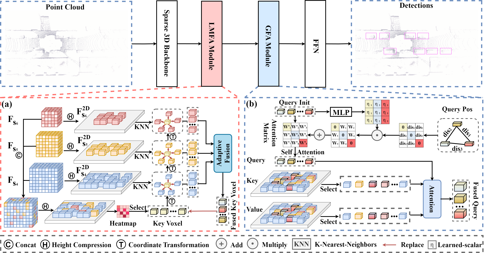

<div align="center">   

  # SparseDet: A Simple and Effective Framework for Fully Sparse LiDAR-based 3D Object Detection 
</div>

<div align="center">
  
</div>

<div align="justify">  

This is the official repository of [**SparseDet**](https://arxiv.org/pdf/2406.10907). 

In order to achieve efficient detection while effectively aggregating contextual information in sparse frameworks, in this study,  we propose a simple and effective fully sparse 3D object detection framework called SparseDet. SparseDet utilizes a 3D sparse convolutional network to extract features from point clouds and transforms them into 2D sparse features for further prediction via detection head. SparseDet designs sparse queries as object proxies, allowing to flexibly and selectively aggregate point clouds to obtain object proxies in a scene. Compared to the previous sparse aggregation paradigm FSD,FSDV2, firstly, SparseDet extends the aggregation of local contextual information to multi-scales feature space, thereby obtaining richer local information. Furthermore, in contrast to prior methods FSD,FSDV2 that only focus on aggregating foreground point features, SparseDet can aggregate the scene-level context for each instance to facilitate potential collaboration between the scene and instance features. Finally, SparseDet does not require any additional auxiliary task.

------

:fire: Contributions:
* We summarized the issues present in existing sparse detection methods and proposed SparseDet to address these problems, which enables to improve the performance of Sparse Lidar-based 3D object detection methods.
* SparseDet is composed of two modules, Local Multi-scale Feature Aggregation (LMFA) module and the Global Feature Aggregation (GFA) module, to achieve efficient detection while effectively aggregating contextual information in sparse framework.
* Experiments which are conducted on the KITTI and nuScenes benchmarks demonstrate the effectiveness of our SparseDet. On nuScenes dataset, SparseDet achieves better performance than FSDV2 and is 1.38 times faster than FSDV2 on FPS. And on KITTI, SparseDet surpasses VoxelNeXt by 1.12\% AP on hard level tasks.

</div>


# Method

<div align="center">
  
</div>

<div align="justify">

An overview of SparseDet framework. First, we voxelizes point clouds and feed voxels into a 3D sparse convolution backbone. Then, we perform high compression on sparse voxel features of the last three layers in the 3D backbone to obtain 2D sparse features of these three layers. In LMFA, we concat them. Then, we perform key voxel position prediction using a heatmap. Through coordinate transformation, we convert the key voxel features to the different scale spaces and aggregate the neighborhood voxel context based of K Nearest Neighbor (KNN) relationships. Subsequently, we replace the key voxel features by aggregated voxel features back into $F_{Fusion}^{2D}$ based on the indices to enhance the feature representation capability of sparse features. In GFA module, we utilizes sparse voxels as queries to adaptively aggregate global sparse voxel features, where scale-adaptive weight map allows queries to autonomously learn the receptive field for aggregating information from relevant positions. At last, the aggregated queries are fed into FFN for result prediction. Adaption Fusion means the adaptive fusion of multi-scale features and FFN is a Feed Forward Neural Network.

</div>

# Dataset Preparation

**NuScenes Dataset** : Please download the [official NuScenes 3D object detection dataset](https://www.nuscenes.org/download) and organize the downloaded files as follows:

```
OpenPCDet
├── data
│   ├── nuscenes
│   │   │── v1.0-trainval (or v1.0-mini if you use mini)
│   │   │   │── samples
│   │   │   │── sweeps
│   │   │   │── maps
│   │   │   │── v1.0-trainval  
├── pcdet
├── tools
```

Install the `nuscenes-devkit` with version `1.0.5` by running the following command:

```bash
pip install nuscenes-devkit==1.0.5
```

Generate the data infos (for multi-modal setting) by running the following command (it may take several hours):

```bash
python -m pcdet.datasets.nuscenes.nuscenes_dataset --func create_nuscenes_infos \
    --cfg_file tools/cfgs/dataset_configs/nuscenes_dataset.yaml \
    --version v1.0-trainval
```

# Requirements

All the codes are tested in the following environment:

* Linux (tested on Ubuntu 14.04/16.04/18.04/20.04/21.04)
* Python 3.8+
* torch                     1.12.1+cu113
* torchaudio              0.12.1+cu113
* torchvision              0.13.1+cu113
* scipy                     1.10.1
* spconv-cu113              2.3.6

All codes are developed based on [OpenPCDet](https://github.com/open-mmlab/OpenPCDet/blob/master/docs/INSTALL.md) .

# Train and Inference

* Training is conducted on 8 NVIDIA GeForce RTX 3090 24G GPUs. 
```bash
CUDA_VISIBLE_DEVICES=0,1,2,3,4,5,6,7 python -m torch.distributed.launch --nproc_per_node=8 --master_port 29535  train.py --launcher pytorch --batch_size 24  --extra_tag train --cfg_file cfgs/sparsedet_models/****.yaml  --save_to_file 
```

* During inference, we remove Test Time Augmentation (TTA) data augmentation, and the batch size is set to 1 on an A100 GPU.
```bash
CUDA_VISIBLE_DEVICES=0 python -m torch.distributed.launch --nproc_per_node=1 --master_port 29541 test.py --launcher pytorch --batch_size 1 --extra_tag test --cfg_file cfgs/sparsedet_models/****.yaml --start_epoch 1 --eval_all --save_to_file --ckpt_dir ../output
```

# Bibtex
If this work is helpful for your research, please consider citing the following BibTeX entry.
```
@article{liu2024sparsedet,
  title={SparseDet: A Simple and Effective Framework for Fully Sparse LiDAR-based 3D Object Detection},
  author={Liu, Lin and Song, Ziying and Xia, Qiming and Jia, Feiyang and Jia, Caiyan and Yang, Lei and Pan, Hongyu},
  journal={arXiv preprint arXiv:2406.10907},
  year={2024}
}


```


# Acknowledgement
Many thanks to these excellent open source projects:
- [OpenPCDet](https://github.com/open-mmlab/OpenPCDet)
- [TransFusion](https://github.com/XuyangBai/TransFusion/)  
